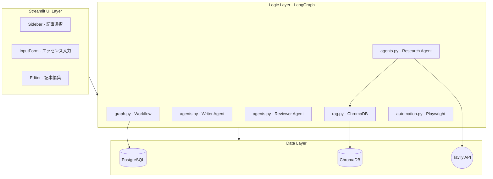
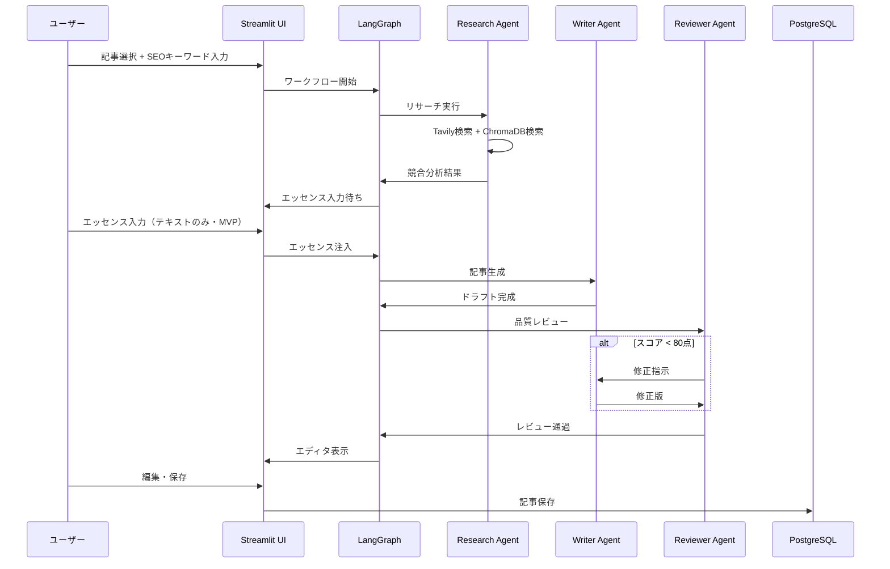
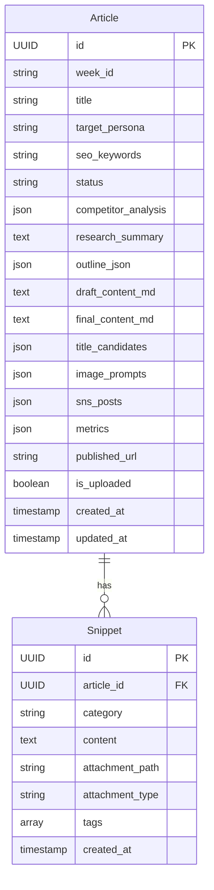

# Design Document: EPM Note Engine

---
**Purpose**: EPM Note Engineの技術設計を定義し、実装の一貫性を確保する。
---

## Overview

**Purpose**: EPM Note Engineは、経営管理SaaS「EPM」のマーケティング活動を支援するため、高品質なNote記事を半自動生成し、投稿負荷を極限まで下げる。

**Users**: Product Owner（Tomoyuki氏）が週2本のNote記事作成に使用する。記事候補の選択からSEO分析、執筆、レビュー、Note.comへの下書き保存までを1つのワークフローで実行する。

**Impact**: 手動での記事作成・投稿作業を自動化し、マーケティング活動の効率を大幅に向上させる。

### Goals
- SEO競合分析に基づく高品質記事の半自動生成
- ユーザーの暗黙知（エッセンス）を構造化して記事に反映
- AI自己推敲ループによる品質担保（80点以上で通過）
- Note.comへの下書き保存を自動化（Last-Mile Automation）

### Non-Goals
- Note.com以外のプラットフォームへの投稿（将来検討）
- 完全自動投稿（人間レビュー必須）
- 画像の自動生成（image_promptsの出力まで）
- リアルタイムコラボレーション機能

### MVP Scope Exclusions
- **音声ファイル入力**: MVP後に対応（Whisper文字起こし検討）
- **画像ファイル入力**: MVP後に対応
- **Note.comへの画像アップロード**: MVP後に対応（テキストのみ下書き保存）

---

## Architecture

### Architecture Pattern & Boundary Map

**Selected Pattern**: Layered Architecture（3層構成）



**Architecture Integration**:
- **Selected pattern**: Layered Architecture（UI → Logic → Database）
- **Domain boundaries**: UI層はLogic層のみに依存、Logic層はUI非依存でテスト可能
- **Existing patterns preserved**: N/A（Greenfield）
- **New components rationale**: LangGraphでAIワークフロー状態管理、Playwrightで自動化
- **Steering compliance**: structure.md定義のディレクトリ構成に準拠

### Technology Stack

| Layer | Choice / Version | Role in Feature | Notes |
|-------|------------------|-----------------|-------|
| Frontend / UI | Streamlit 1.30+ | 対話的UI、セッション管理 | Python単体で構築 |
| Backend / Logic | LangChain 0.1+, LangGraph | AIワークフロー、状態管理 | Stateful Workflow |
| AI Model (Main) | Claude 3.5 Sonnet | 記事執筆、レビュー | Anthropic API |
| AI Model (Sub) | GPT-4o | 検索、マルチモーダル | OpenAI API |
| Data / RDB | PostgreSQL 15+ | 記事・スニペット永続化 | Docker Compose |
| Data / Vector | ChromaDB | RAG検索 | Persistent Client |
| ORM | SQLAlchemy 2.0+ | DB操作 | Async対応 |
| Automation | Playwright | Note.com自動投稿 | Headless Browser |
| External API | Tavily API | 競合記事検索 | Deep Research |

---

## System Flows

### Main Workflow: 記事生成フロー



### Note.com自動投稿フロー

```mermaid
sequenceDiagram
    participant User as ユーザー
    participant UI as Streamlit UI
    participant PW as Playwright
    participant Note as Note.com

    User->>UI: 「Noteへ下書き保存」クリック
    UI->>PW: 自動化開始
    PW->>Note: ログイン（EMAIL/PASSWORD）
    Note->>PW: ログイン成功
    PW->>Note: 新規投稿画面へ
    PW->>Note: タイトル・本文入力
    PW->>Note: 下書き保存クリック
    Note->>PW: 保存完了
    PW->>UI: 成功通知
    UI->>UI: is_uploaded = True
```

---

## Requirements Traceability

| Requirement | Summary | Components | Interfaces | Flows |
|-------------|---------|------------|------------|-------|
| 1.1-1.5 | 記事候補管理・選択 | Sidebar, ArticleRepository | ArticleService | - |
| 2.1-2.6 | SEOリサーチ・競合分析 | ResearchAgent, RAGService | TavilyClient, ChromaDB | リサーチフロー |
| 3.1-3.6 | エッセンス注入 | InputForm, SnippetRepository | FileUploader | - |
| 4.1-4.8 | 記事生成・レビューループ | WriterAgent, ReviewerAgent, LangGraph | GraphState | メインワークフロー |
| 5.1-5.6 | 記事エディタ | Editor | ArticleService | - |
| 6.1-6.9 | Note.com自動投稿 | PlaywrightAutomation | NoteUploader | 自動投稿フロー |
| 7.1-7.4 | ナレッジ資産管理 | RAGService, SnippetRepository | ChromaDB | - |
| 8.1-8.5 | データ永続化 | Database, Models | SQLAlchemy | - |

---

## Components and Interfaces

### Component Summary

| Component | Domain/Layer | Intent | Req Coverage | Key Dependencies | Contracts |
|-----------|--------------|--------|--------------|------------------|-----------|
| app.py | UI | Streamlitエントリポイント | All | Streamlit (P0) | - |
| Sidebar | UI | 記事選択UI | 1.1-1.5 | ArticleRepository (P0) | State |
| InputForm | UI | エッセンス入力UI | 3.1-3.6 | SnippetRepository (P0) | State |
| Editor | UI | 記事編集UI | 5.1-5.6 | ArticleRepository (P0) | State |
| LangGraph | Logic | ワークフロー管理 | 4.1-4.8 | LangChain (P0) | Service |
| ResearchAgent | Logic | 競合分析 | 2.1-2.6 | Tavily (P0), ChromaDB (P1) | Service |
| WriterAgent | Logic | 記事生成 | 4.1-4.4 | Claude API (P0) | Service |
| ReviewerAgent | Logic | 品質レビュー | 4.5-4.7 | Claude API (P0) | Service |
| RAGService | Logic | ベクトル検索 | 7.1-7.2 | ChromaDB (P0) | Service |
| PlaywrightAutomation | Logic | Note.com自動化 | 6.1-6.9 | Playwright (P0) | Service |
| ArticleRepository | Data | 記事CRUD | 8.1-8.5 | SQLAlchemy (P0) | Service |
| SnippetRepository | Data | スニペットCRUD | 3.2-3.5, 7.3 | SQLAlchemy (P0) | Service |

---

### Logic Layer

#### LangGraph Workflow

| Field | Detail |
|-------|--------|
| Intent | 記事生成ワークフローの状態管理と遷移制御 |
| Requirements | 4.1-4.8 |

**Responsibilities & Constraints**
- Research → WaitingInput → Drafting → Review → Complete の状態遷移
- Reviewerスコア80点未満で修正ループ（最大1回）
- 状態はTypedDictで型安全に管理

**Dependencies**
- Outbound: ResearchAgent, WriterAgent, ReviewerAgent — ノード実行 (P0)
- External: LangChain/LangGraph — ワークフローエンジン (P0)

**Contracts**: Service [x]

##### Service Interface
```python
from typing import TypedDict, Literal

class ArticleState(TypedDict):
    article_id: str
    phase: Literal["research", "waiting_input", "drafting", "review", "complete"]
    seo_keywords: str
    research_summary: str
    essences: list[dict]
    draft_content: str
    review_score: int
    review_feedback: str
    retry_count: int

class WorkflowService:
    def run_workflow(self, article_id: str, seo_keywords: str) -> ArticleState:
        """ワークフロー全体を実行"""
        ...

    def resume_workflow(self, state: ArticleState) -> ArticleState:
        """中断したワークフローを再開"""
        ...
```

---

#### ResearchAgent

| Field | Detail |
|-------|--------|
| Intent | SEO競合分析と社内資料検索を実行 |
| Requirements | 2.1-2.6 |

**Responsibilities & Constraints**
- Tavily APIで競合上位記事を検索・分析
- ChromaDBから関連社内資料を検索
- Content Gapと構成案を生成

**Dependencies**
- External: Tavily API — Web検索 (P0)
- External: ChromaDB — ベクトル検索 (P1)

**Contracts**: Service [x]

##### Service Interface
```python
from dataclasses import dataclass

@dataclass
class CompetitorAnalysis:
    urls: list[str]
    headings: list[list[str]]
    content_gaps: list[str]

@dataclass
class ResearchResult:
    competitor_analysis: CompetitorAnalysis
    internal_references: list[str]
    suggested_outline: list[str]
    research_summary: str

class ResearchAgent:
    def analyze(self, seo_keywords: str) -> ResearchResult:
        """SEOキーワードに基づく競合分析を実行"""
        ...
```

---

#### WriterAgent

| Field | Detail |
|-------|--------|
| Intent | 記事本文・SNS投稿文・タイトル候補を生成 |
| Requirements | 4.1-4.4 |

**Responsibilities & Constraints**
- リサーチ結果とエッセンスを基に記事生成
- Markdown形式で出力
- 図解プロンプト（image_prompts）を生成

**Dependencies**
- External: Claude 3.5 Sonnet API — 記事生成 (P0)

**Contracts**: Service [x]

##### Service Interface
```python
@dataclass
class DraftResult:
    draft_content_md: str
    title_candidates: list[str]
    image_prompts: list[str]
    sns_posts: dict[str, str]  # {"x": "...", "linkedin": "..."}

class WriterAgent:
    def generate_draft(
        self,
        research_result: ResearchResult,
        essences: list[dict],
        target_persona: str
    ) -> DraftResult:
        """記事ドラフトを生成"""
        ...
```

---

#### ReviewerAgent

| Field | Detail |
|-------|--------|
| Intent | 生成記事の品質評価とフィードバック |
| Requirements | 4.5-4.7 |

**Responsibilities & Constraints**
- ターゲットへの訴求力、論理構成、SEO適合性を評価
- 100点満点でスコアリング
- 80点未満の場合は修正指示を出力

**Scoring Rubric（評価基準）**

| 評価項目 | 配点 | 評価観点 |
|---------|------|---------|
| ターゲット訴求力 | 30点 | ペルソナの課題・悩みに直接言及しているか、共感を得られる表現か |
| 論理構成 | 40点 | 導入→本論→結論の流れが明確か、主張と根拠が対応しているか |
| SEO適合性 | 30点 | キーワードが適切に配置されているか、見出し構成が競合に勝てるか |

**Dependencies**
- External: Claude 3.5 Sonnet API — 評価 (P0)

**Contracts**: Service [x]

##### Service Interface
```python
@dataclass
class ScoreBreakdown:
    target_appeal: int      # 0-30: ターゲット訴求力
    logical_structure: int  # 0-40: 論理構成
    seo_fitness: int        # 0-30: SEO適合性

@dataclass
class ReviewResult:
    score: int              # 0-100: 合計スコア
    breakdown: ScoreBreakdown
    feedback: str           # 改善フィードバック
    passed: bool            # score >= 80

class ReviewerAgent:
    def review(
        self,
        draft_content: str,
        target_persona: str,
        seo_keywords: str
    ) -> ReviewResult:
        """記事品質をレビュー"""
        ...
```

---

#### PlaywrightAutomation

| Field | Detail |
|-------|--------|
| Intent | Note.comへの下書き保存を自動化 |
| Requirements | 6.1-6.9 |

**Responsibilities & Constraints**
- Headless Browserでログイン・投稿を自動化
- 失敗時はスクリーンショット保存
- 成功時にis_uploadedフラグを更新

**Dependencies**
- External: Playwright — ブラウザ自動化 (P0)
- External: Note.com — 投稿先 (P0)

**Contracts**: Service [x]

##### Service Interface
```python
@dataclass
class UploadResult:
    success: bool
    error_message: str | None
    screenshot_path: str | None

class NoteUploader:
    def upload_draft(
        self,
        title: str,
        content_md: str,
        email: str,
        password: str
    ) -> UploadResult:
        """Note.comに下書き保存"""
        ...
```

---

### Data Layer

#### ArticleRepository

| Field | Detail |
|-------|--------|
| Intent | 記事データのCRUD操作 |
| Requirements | 8.1-8.5, 1.1-1.5 |

**Contracts**: Service [x]

##### Service Interface
```python
from uuid import UUID
from database.models import Article

class ArticleRepository:
    def get_all(self) -> list[Article]:
        """全記事を取得"""
        ...

    def get_by_id(self, article_id: UUID) -> Article | None:
        """IDで記事を取得"""
        ...

    def update(self, article: Article) -> Article:
        """記事を更新"""
        ...

    def create(self, article: Article) -> Article:
        """記事を作成"""
        ...
```

---

## Data Models

### Domain Model



### Physical Data Model

**Table: articles**

| Column | Type | Constraints | Notes |
|--------|------|-------------|-------|
| id | UUID | PK | gen_random_uuid() |
| week_id | VARCHAR(50) | NOT NULL | 例: "Week1-1" |
| title | VARCHAR(255) | NOT NULL | |
| target_persona | VARCHAR(255) | | |
| seo_keywords | VARCHAR(255) | | |
| status | VARCHAR(50) | NOT NULL, DEFAULT 'PLANNING' | ENUM相当 |
| competitor_analysis | JSONB | | |
| research_summary | TEXT | | |
| outline_json | JSONB | | |
| draft_content_md | TEXT | | |
| final_content_md | TEXT | | |
| title_candidates | JSONB | | Array of strings |
| image_prompts | JSONB | | Array of strings |
| sns_posts | JSONB | | {"x": "...", "linkedin": "..."} |
| metrics | JSONB | | {"pv": 0, "likes": 0, "ctr": 0} |
| published_url | VARCHAR(500) | | |
| is_uploaded | BOOLEAN | DEFAULT FALSE | |
| created_at | TIMESTAMPTZ | DEFAULT NOW() | |
| updated_at | TIMESTAMPTZ | DEFAULT NOW() | |

**Table: snippets**

| Column | Type | Constraints | Notes |
|--------|------|-------------|-------|
| id | UUID | PK | gen_random_uuid() |
| article_id | UUID | FK → articles.id | |
| category | VARCHAR(50) | NOT NULL | FAILURE, OPINION, TECH, HOOK |
| content | TEXT | NOT NULL | |
| attachment_path | VARCHAR(500) | | |
| attachment_type | VARCHAR(50) | | MIME type |
| tags | VARCHAR[] | | PostgreSQL配列 |
| created_at | TIMESTAMPTZ | DEFAULT NOW() | |

### Vector Store (ChromaDB)

**Collection: knowledge_base**
- Purpose: 社内資料（PDF/MD）のベクトルインデックス
- Metadata: source_path, document_type, created_at

**Collection: archive_index**
- Purpose: 過去記事 + スニペットのベクトルインデックス
- Metadata: article_id, snippet_id, category

---

## Error Handling

### Error Strategy
- ユーザーエラー: 入力バリデーション、分かりやすいメッセージ表示
- システムエラー: ログ出力 + スクリーンショット保存（Playwright）
- API失敗: リトライオプション提供、フォールバック表示

### Error Categories and Responses

| Category | Error | Response |
|----------|-------|----------|
| User (4xx) | SEOキーワード未入力 | フィールドハイライト + メッセージ |
| System (5xx) | Tavily API失敗 | エラーメッセージ + リトライボタン |
| System (5xx) | Playwright失敗 | スクリーンショット保存 + 詳細表示 |
| Business (422) | レビュースコア低下 | 修正ループへ遷移（自動） |

---

## Testing Strategy

### Unit Tests
- `test_research_agent.py` — 競合分析ロジック
- `test_writer_agent.py` — 記事生成ロジック
- `test_reviewer_agent.py` — スコアリングロジック
- `test_rag_service.py` — ベクトル検索

### Integration Tests
- `test_workflow.py` — LangGraphワークフロー全体
- `test_database.py` — PostgreSQL CRUD
- `test_chromadb.py` — ChromaDB永続化

### E2E Tests
- `test_note_upload.py` — Playwright Note.com投稿（手動トリガー推奨）

---

## Security Considerations

- **認証情報管理**: 全APIキー・認証情報は環境変数（.env）で管理
- **Note.com認証**: EMAIL/PASSWORDは.envに保存、コードにハードコードしない
- **.gitignore**: .env, data/uploads/, data/chroma_db/ を除外

---

## Performance & Scalability

- **記事生成時間**: 目標5分以内（AI処理含む）
- **UI応答**: 2秒以内
- **同時実行**: 1ユーザー想定、並行処理は非対応

---

## Supporting References

詳細な調査ログ・意思決定の背景は `research.md` を参照。
